# Rapport rendu projet Island Viewer

Il s'agit du rapport du projet de Prog. Algo. de S2 IMAC 2025-2026

### Les IMACS responsables
Jade Riesen - Agathe Olivier - Jacquemin Roméo

### Plateformes de développement

Agathe et Roméo ont travaillés sur Windows et Jade sur MacOS

# Projet initial et répartition des tâches

## Projet initial

Au démarrage, nous avons récupéré le clone d'un projet existant dans lequel nous pouvions visualiser une petite carte d'une île générée aléatoirement sur laquelle des cubes rouges étaient placés, eux-aussi aléatoirement.

## Répartition des tâches

### Objectifs algorithmiques obligatoires

Bruit Fractal - Jade
Génération de heightmap et couleurs - Agathe
Distribution de points par Poisson disk sampling - Roméo
Placement des objets sur le terrain - Roméo

### Améliorations

Importations de modèles 3D pour les objets - Agathe
Ajout d’un autre type de bruit “Simplex” et combinaisons - Jade
Création de biomes - Agathe

# Autre

## Écriture du rapport - Roméo, Agathe et Jade

### Rapport technique

## Bruit fractal

### Les choix algorithmiques faits

Une fonction de bruit fractal du type FBM a été implémentée à l’aide des ressources proposées sur le sujet. On l’a ensuite intégrée au code pour qu’elle affiche un type de bruit fournie en paramètre avec plus de détails. De plus on a ajouté 3 curseurs qui permettent de modifier visuellement en direct certains paramètres de la fonction :
Le nombre d’octaves qui contrôle le nombre de couches superposées pour avoir plus de précision.
La lacunarité qui détermine de combien la fréquence du bruit augmente à chaque octave.
Le gain qui détermine de combien l'amplitude diminue à chaque octave.
La scale pour contrôler la "taille" du bruit généré

### Les paramètres retenus et leur impact visuel

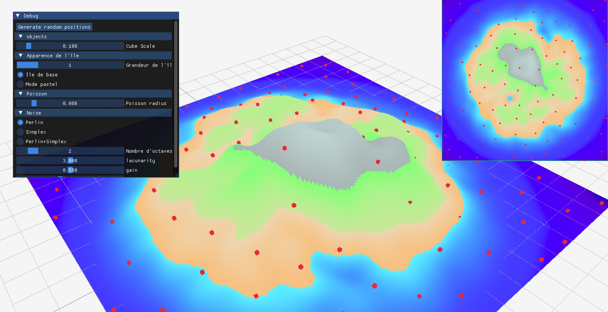

Figure 1 : Nombre d’octave = 2	

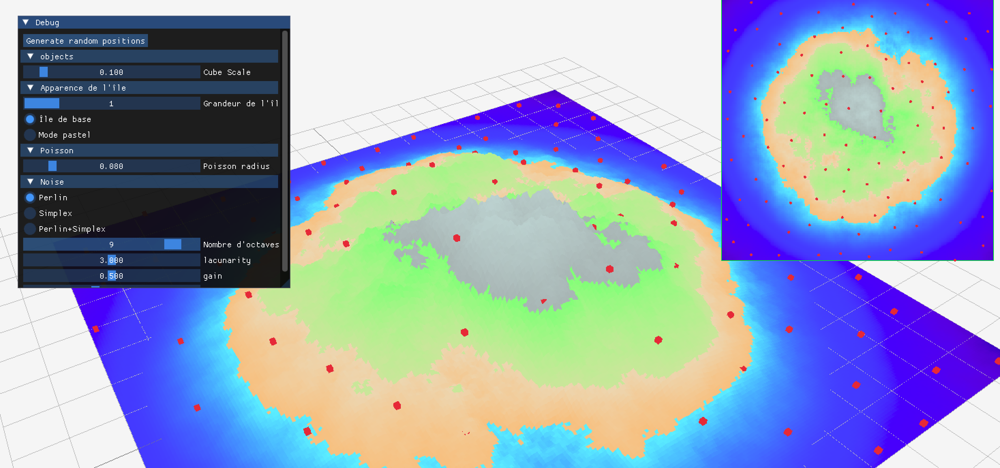

Figure 2 : Nombre d’octave = 9

On constate sur la figure 1 que pour un petit nombre d'octaves l’île est presque lisse. Lorsqu’on augmente le nombre d'octaves, comme sur la figure 2, l’île devient plus détaillée.

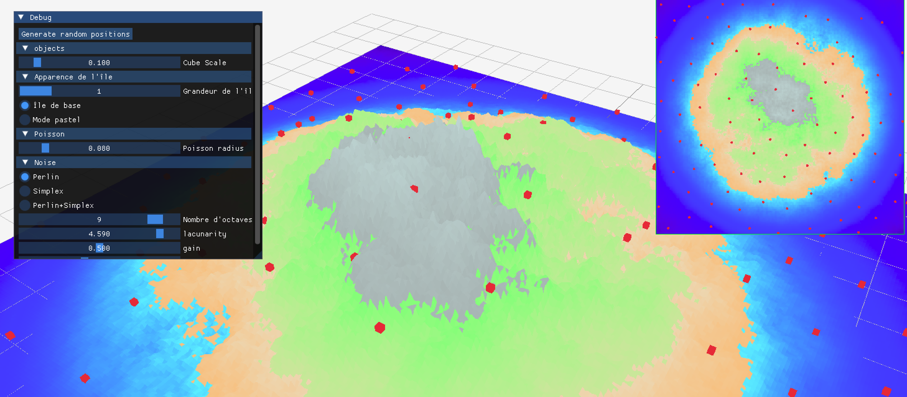

Figure 3 : Lacunarité = 4,6	

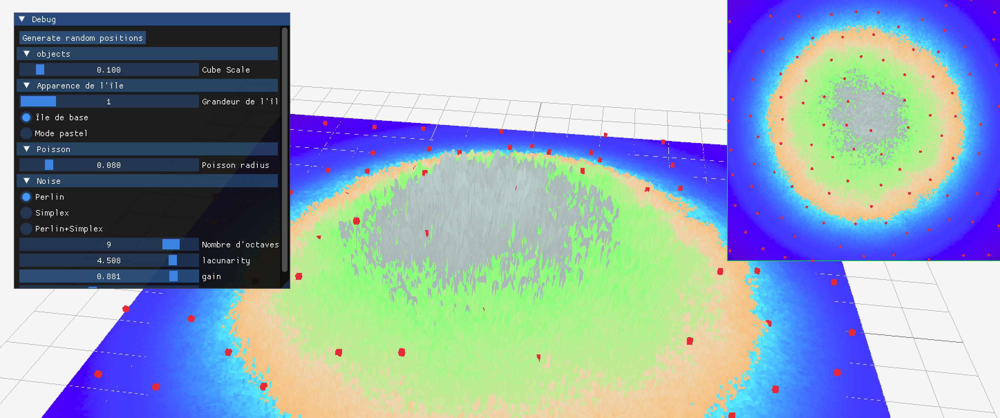

Figure 4 : Gain = 0,9

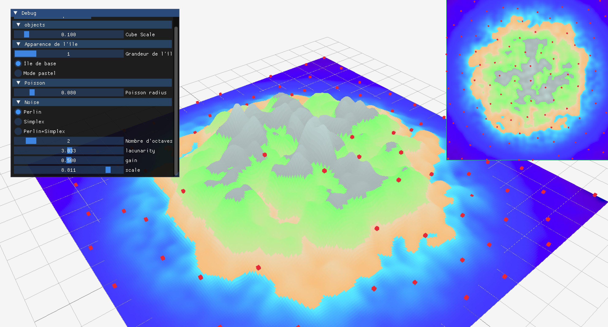

Figure 5 : Scale = 8,8

En augmentant la lacunarité (figure 3) par rapport à la figure 2, on comprend qu’encore plus de détails sont marqués sur l’image du fait de l’augmentation de la fréquence du bruit à chaque octave. En augmentant le gain (figure 4), l’amplitude diminue moins à chaque couche et rend les détails plus fins. Enfin en augmentant la scale (figure 5), par rapport à la figure 1, ça fait comme si l’île se divisait un peu.

### Les difficultés rencontrées et solutions
La plus grosse difficulté n’était pas tant l'implémentation du code mais la compréhension du code préexistant et son découpage pour savoir où écrire quoi.
De plus, il fallait appeler dans une fonction la fonction FBM qui prend elle-même une fonction en paramètre. Il était donc nécessaire d’utiliser deux fois des fonctions Lambda et ça m’a un peu embrouillé l’esprit.

## Génération de heightmap et couleurs - Agathe

### Les choix algorithmiques faits

Pour la heightmap, j’ai décidé de demander conseils à Jules en TD, et je suis partie sur la fonction sinus pour le masque. En effet, c’est la première qui m’est venue en tête pour avoir la forme d’un cercle. Je me suis aidée de Géogébra pour trouver les bonnes valeurs de variables.

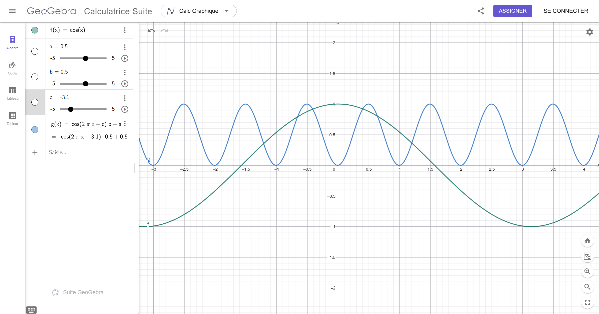

J’avais d’abord fait le masque en fonction des positions x et y des points de la map, mais ça posait des problèmes pour les bords, alors Jules m’a aidé à changer les variables pour que le masque dépende de la distance du point en fonction du centre de la map.

Concernant le choix pour les couleurs, je ne savais qu’une fonction dégradée existait déjà. J’ai donc repris le code de mon Workshop avec Jules pour avoir des dégradés en OK Lab pour avoir un meilleur rendu (le code de conversion de couleur est le sien), que j’ai adapté au projet. J’ai choisi de fonctionner avec un tableau qui contient toutes les couleurs d’un biome. Comme ça, au moment de changer de biome, il suffit de changer l’indice du tableau pour changer les couleurs de la map.

### Les paramètres retenus et leur impact visuel

Grâce à la fonction sinus, nous avons obtenu une île beaucoup plus “ronde” que les autres groupes. Il y a moins de variation de rendu, mais on aimé ce rendu qui nous rappelait vraiment une île.

Concernant les couleurs, travailler en OKLAB a permis d’obtenir des dégradés assez facilement et plutôt jolis. Le rangement de toutes les couleurs dans un tableau à grandement facilité la création des biomes. Pour avoir un meilleur rendu, j’ai créé des palettes de couleurs au préalable sur canva comme il peut être dur d’imaginer les couleurs en décimal, puis je les ai converties. Comme j’ai travaillé dans l’espace OKLAB, j’avais vraiment le même rendu en terme de couleurs :

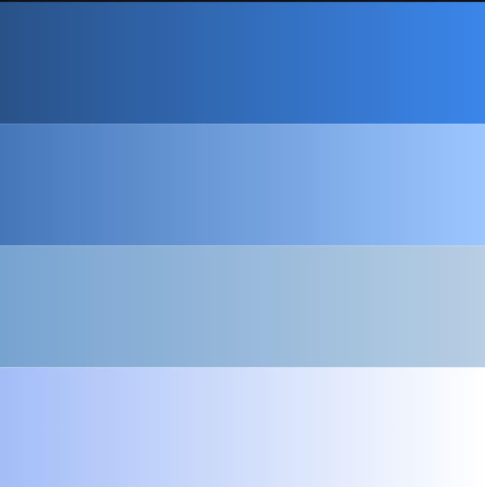

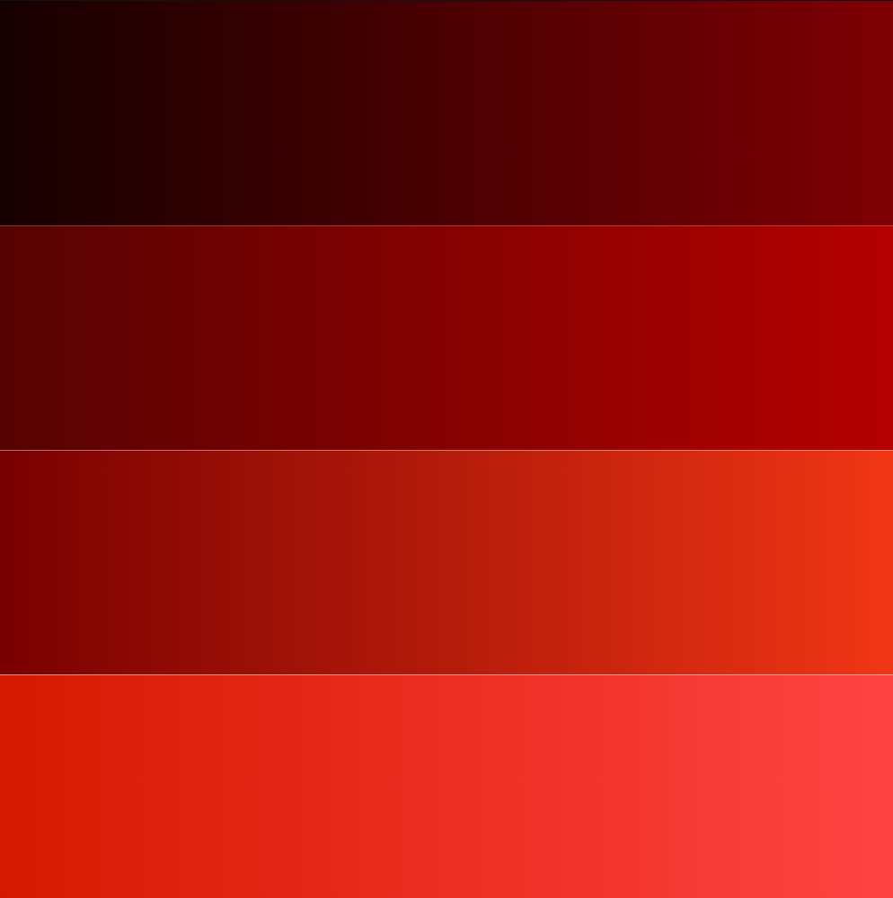

### Les difficultés rencontrées et solutions

Pour la heightmap, la plus grande difficulté a été les maths 😂 Même quand ma formule fonctionnait, j’avais du mal à la modifier pour obtenir le rendu que j’avais en tête. La solution a été de travailler avec geogebra tout simplement pour avoir une idée plus visuelle de ce que j’étais en train de faire.

Pour les couleurs, je n’ai pas rencontré de difficultés particulières. C’était juste un peu long à faire mais rien de difficile. Juste bien pensé à clamp les valeurs ou le résultat était un peu bizarre.

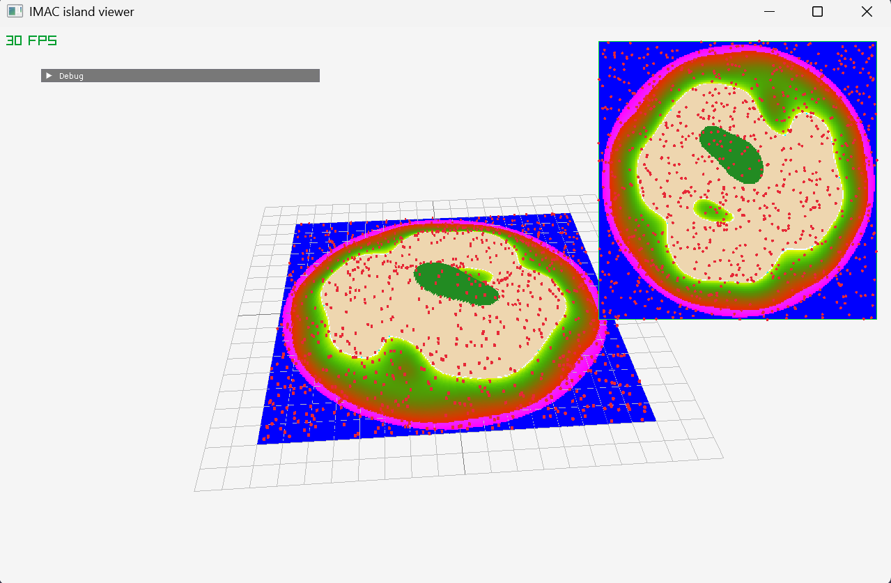

Avant le Clamp

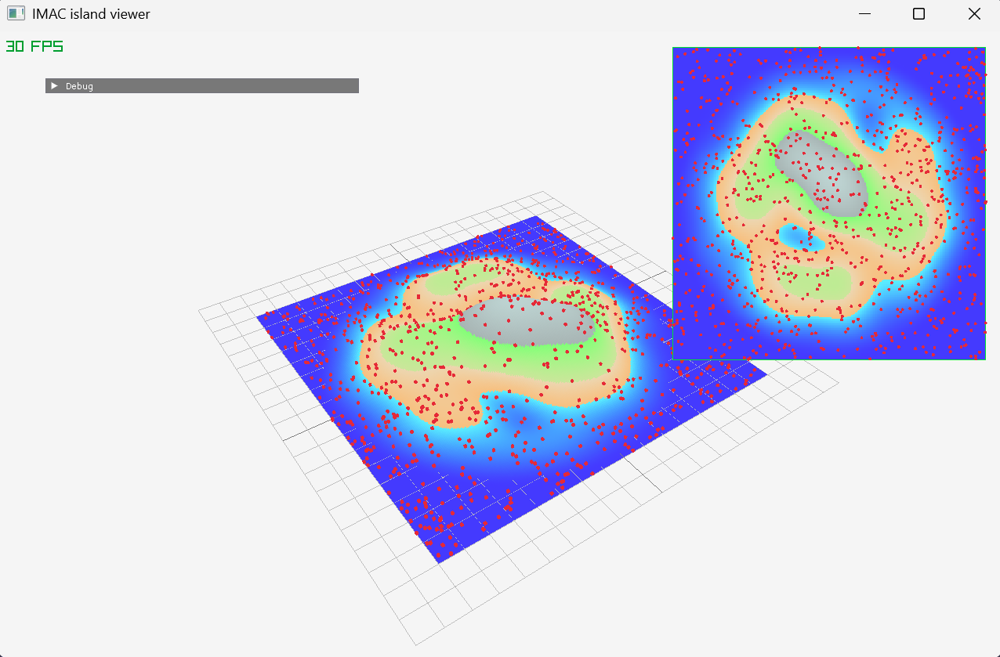

Après le Clamp

## Distribution de points par Poisson disk sampling

### Choix algorithmiques

Il n'y a pas eu de choix algorithmiques particuliers pendant l'implémentation du Poisson disk sampling.
J'ai suivi l'algorithme de base à la lettre pour sa mise en place.

### Paramètres retenus

Pour le Poisson disk sampling j'ai retenu les paramètres suivants :
- r, la variable qui définit la distance minimale entre chaque point.

### Difficultées

Pendant l'implémentation du Poisson disk sampling, j'ai rencontré plusieurs erreurs, je vais les présenter par ordre chronologique.

- Mécompréhension du fonctionnement de l'algorithme
Avant de commencer à coder, il fallait comprendre l’algorithme, et ça n’a pas été le plus simple, j’ai eu besoin de lire plusieurs fois le sujet pour le comprendre

- Mauvaise utilisation des listes qui cassait tout
Dans la continuation de la première erreur, dans ma première implémentation, je n’avais pas vraiment compris à quoi servaient les listes et donc je les utilisais mal. Pour résoudre ce problème, j’ai juste relu mon code jusqu’à me rendre compte qu’il y avait un soucis

- Difficulté d'implémentation de la grille
La grille parle d’elle-même, elle m’a fait mal au crâne.

## Placement des objets sur le terrain
### Choix algorithmiques
Pour les paramètres de base pour chaque biome j’ai décidé de travailler avec la variable d’Agathe pour changer les hauteurs par défaut.
### Paramètres retenus
J’utilise deux variables “hauteur min” et “hauteur max” pour changer ces valeurs
### Difficultées
a pas

## Import d'un mesh 3D pour le placement d'objets

### Les choix algorithmiques faits

Pour cette partie, il n’y a pas vraiment eu de choix algorithmique important, j’ai juste suivi le dernier exemple mis à disposition.

### Les paramètres retenus et leur impact visuel

Pour le choix des modèles, on avait déjà eu l’idée dès le début du projet et on savait dans quel biome les placer, les deux ont été conçus en même temps.
Encore une fois, avoir attribué un indice par biome à grandement facilité le changement de modèle, permettant de les changer avec un simple if en fonction du biome choisi.

### Les difficultés rencontrées et solutions

J’ai eu quelques difficultés à comprendre où placer quoi, surtout au moment du changement de modèle 3D en fonction du biome. Je savais qu’il fallait recharger le modèle, mais pas exactement quelle ligne changer et quelle ligne gardée.

J’ai aussi le problème que les modèles 3D n’étaient pas centrés, que Raphaël CADETE et Jules m’ont aidé à régler.

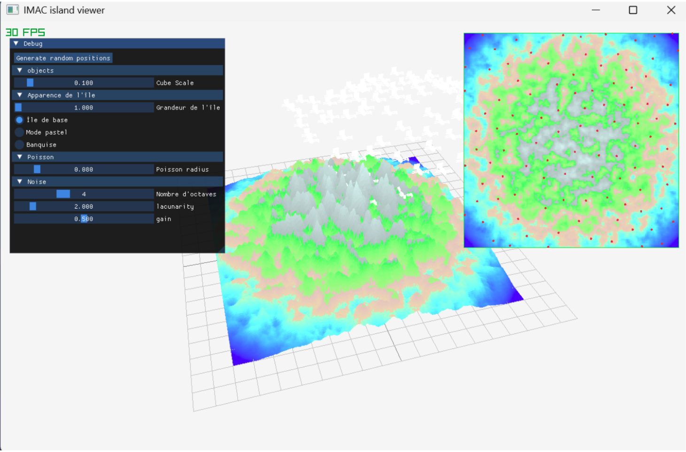

On voit sur la map à droite que les points étaient bien placés mais que les modèles étaient complètement à côté de l’île.
Je ne savais pas qu’on pouvait utiliser directement la matrice de Raylib pour les recentrer donc j’ai eu du mal à le faire jusqu’à ce qu’on m’explique.

## Ajout d’un autre bruit de type Simplex

Comme proposé dans les améliorations, on a souhaité ajouter un autre type de bruit en plus du Perlin. J’ai cru comprendre que le bruit Simplex était un classique alors j’ai fait quelques recherches sur internet pour comprendre son fonctionnement et m’inspirer de certaines implémentations. J’ai compris que la grande différence avec le bruit de Perlin c’est qu’au lieu d’interpoler sur des carrés, on interpole sur des triangles. Pour faciliter l’interpolation on introduit le concept de skewing qui permet de pencher la grille de carrés pour avoir comme des losanges constituéDs de deux triangles et ensuite déterminer dans quel triangle on se trouve pour fixer les 3 coins du triangle. J’ai réécrit le code comme je l’aurais écrit moi sauf pour la partie hashage que j’ai prise d’internet. J’ai ensuite rajouté un bouton pour pouvoir changer de bruit en direct entre Perlin ou Simplex ou bien combiner les deux (moitié moitié).

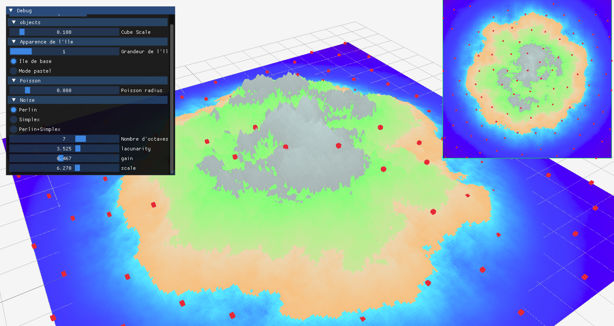

Perlin	

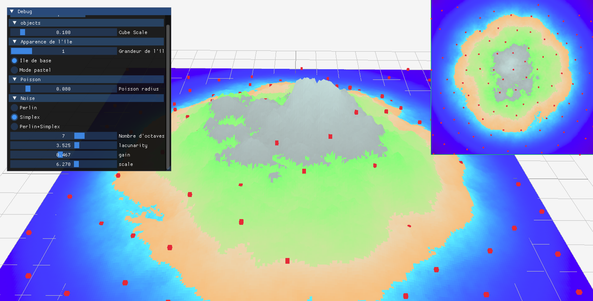

Simplex

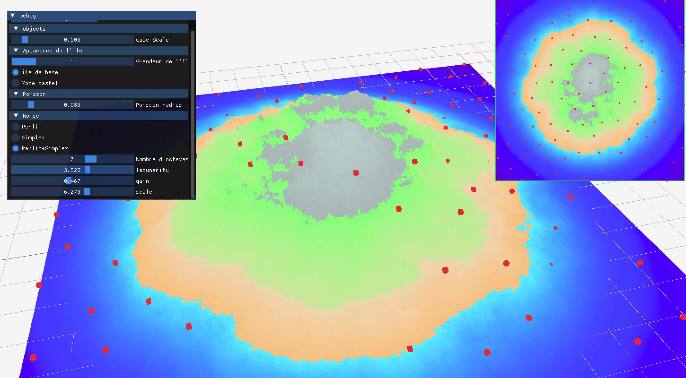

Perlin + Simplex

## Ajout de biomes

### Les choix algorithmiques faits et les paramètres retenus

J’ai choisi de faire le changement de biomes avec des boutons radios et un ID associé à chaque biome pour faciliter l’utilisation commune des biomes dans nos codes.

### Les difficultés rencontrées et solutions

Aucune difficulté rencontrée pour la création des biomes, c’était juste une succession de if. J’ai conscience que sur un plus gros projet, comme un jeu, une solution plus optimisée que d’avoir une succession de if serait mieux. Mais je n’avais pas d’autres idées et le temps limité ne me permettait pas de chercher d’autres solutions.
Nous avons estimé que dans notre cas, la solution des ID était viable.

## IV. Conclusion "post-mortem"

Nous avons trouvé que la répartition des tâches s'était faite plutôt naturellement. Nous avons bien aimé que nous prennions tous le temps de s’expliquer le fonctionnement de nos parties, de se voir IRL pour régler les interrogations quand il y en avait. Nous avons trouvé que nous avions a été efficace dans la répartition de notre temps, et que nous n'avions pas hésité à s’entraider quand nous en avions besoin, même si chacun avait sa partie. Chaque décision a été commune et nous avons le ressenti que l’opinion de chacun a été respectée.

Avec plus de temps, nous aurions aimé faire plus de biomes et faire de vraies animations pour les modèles 3D, pas juste les faire tourner. Ou alors carrément un modèle 3D quz l’on peut contrôler avec les flèches et se balader sur île, comme un vrai jeu vidéo.
Nous aurions également aimé mieux gérer le changement de biomes (gros freeze au moment de changer).

En conclusion, c’était agréable de savoir que peu importe les idées farfelus qu’on avait, les autres étaient d’accord pour essayer avec nous, que ça fonctionne ou non à la fin.

## V. Sources

Pour le débug : 

Jules FOUCHY

Enguerrand DE SMET

Raphaël CADETE et Julien LEEDER

Pour le bruit :
https://thebookofshaders.com/13/?lan=fr
https://thebookofshaders.com/11/?lan=fr
https://www.shadertoy.com/view/MfGyzz

Pour les modèles 3D:
https://pub.dev/documentation/raylib/latest/raylib/drawModelEx.html
https://www.raylib.com/examples/models/loader.html?name=models_loading_gltf
https://sketchfab.com/3d-models/peak-bingbong-model-6d4f626e6c6946958fb80441ea7da27b
https://sketchfab.com/3d-models/le-poisson-steve-cd2fee12e1114cd49a2d2041835c1b8b
https://sketchfab.com/3d-models/fat-rainbow-cat-6d0eaa4145774c5fb254dcb759d5b29e
https://sketchfab.com/3d-models/pingu-34d6e003b6654f428855d3c1c79e7f67